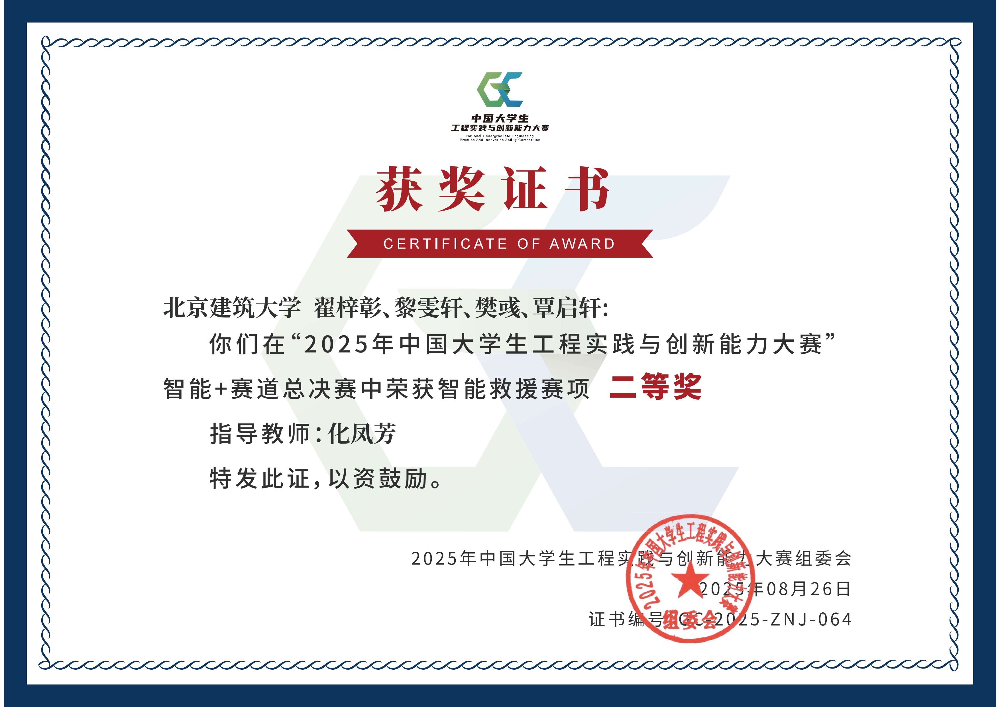
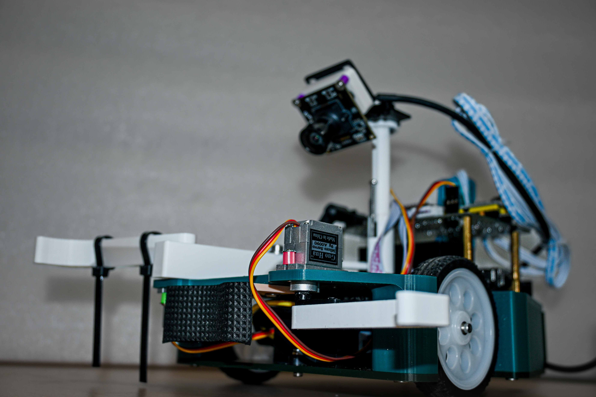

# Intelligent Rescue 2025（智能救援机器人）

> 2025年中国大学生工程实践与创新能力大赛（智能+赛道）智能救援赛项控制系统。

本项目采用 **Jetson（上位机）** + **STM32（下位机）** 的双核心架构，通过视觉识别与 PID 控制实现自动搜救任务。

## 🏆 成果展示

| 获奖证书 | 实物展示 |
| :---: | :---: |
|  |  |

---

## 📂 项目目录结构

```plaintext
intelligent-rescue-2025/
├── LICENSE                  # 项目原创代码的 MIT 许可证
├── README.md                # 项目说明文档
├── THIRD_PARTY_NOTICES.md   # 第三方代码、依赖与素材声明
├── images/                  # 项目展示图片
│   ├── competition-award-2025.jpg
│   └── rescue-robot.jpg
├── jetson/                  # Jetson 上位机 Python 控制程序
│   ├── main.py              # 主程序：有限状态机（FSM）逻辑实现
│   ├── config.py            # 全局配置：队伍参数、阈值、硬件端口
│   ├── control.py           # 运动控制：视觉 PID 追踪与底盘运动解算
│   ├── uart.py              # 通信模块：自定义协议封包与 CRC 校验
│   └── vision.py            # 视觉模块：YOLO 模型推理、坐标变换与滤波
└── stm32/                   # STM32 下位机 C 语言固件
    ├── hardware/            # 硬件驱动层
    │   ├── motor.c/h        # 直流电机驱动与增量式 PID 实现
    │   ├── servo.c/h        # 舵机 PWM 控制
    │   ├── uart.c/h         # 串口 DMA 接收与环形缓冲区处理
    │   ├── oled.c/h         # SSD1306 OLED 屏幕驱动
    │   └── font.c/h         # 字库文件
    └── system/              # 系统层
        └── callback.c/h     # 定时器中断回调与指令解析执行
```

## ✨ 核心功能

* **视觉巡航**：基于 YOLO 模型实时识别不同颜色的目标球体与安全放置区。
* **智能抓取**：视觉伺服 PID 算法控制底盘精准对正，配合舵机机械爪完成抓取。
* **稳定通信**：自定义 UART 串口协议，确保上下位机指令传输的高效与准确。

---

## 👥 团队信息

**北京建筑大学 工程实践创新中心 314 工作室**

* **作者**：樊彧、覃启轩

## 📄 许可证

除下述例外外，本仓库中由樊彧、覃启轩原创并拥有版权的源代码采用 [MIT License](./LICENSE) 许可。

MIT License 不适用于以下内容：

- 仓库中包含或改编的第三方代码，其许可与版权归原作者所有，详见 [THIRD_PARTY_NOTICES.md](./THIRD_PARTY_NOTICES.md)。
- 外部依赖，包括 Ultralytics YOLO、OpenCV、NumPy、PySerial、PyTorch 和 STM32 HAL 等；它们分别适用自身的许可证。
- 模型权重、训练数据和数据集，除非相关目录中另有明确的许可声明。
- `images/` 目录中的照片、证书、赛事标识和其他媒体素材。除非另有明确许可，相关权利均予保留。

### Ultralytics 特别说明

本项目的 Jetson 程序依赖 Ultralytics YOLO。Ultralytics 的开源版本采用 AGPL-3.0 许可，同时提供 Enterprise License。

本项目原创代码的 MIT 许可不包含 Ultralytics 软件或模型，也不会免除使用者遵守 Ultralytics 许可条款的义务。分发、部署或提供包含 Ultralytics YOLO 的完整系统时，可能需要遵守 AGPL-3.0，或另行取得 Ultralytics Enterprise License。
